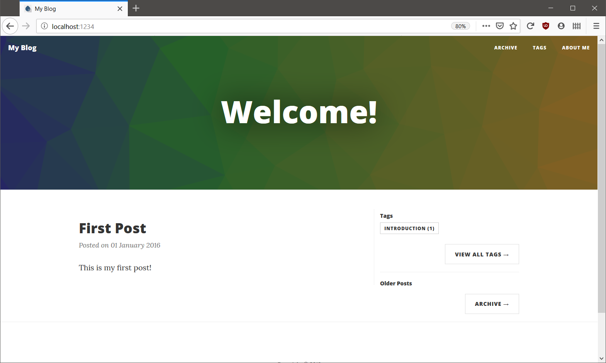
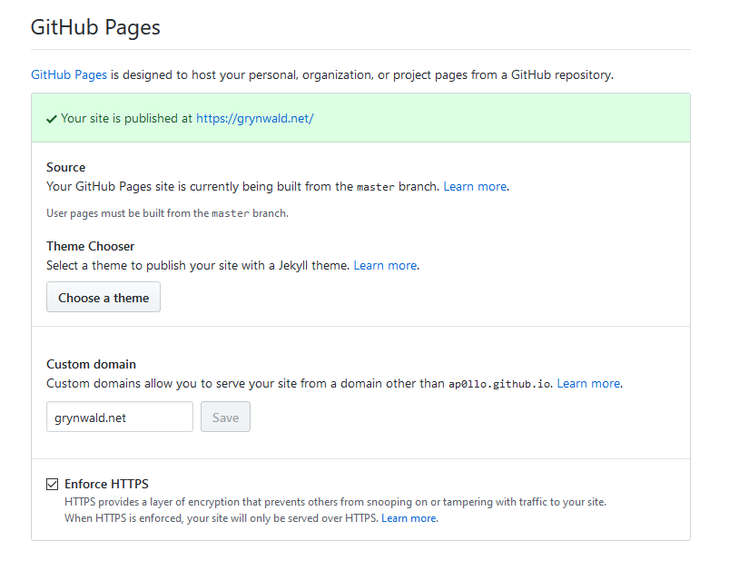

I recently decided to start a personal blog and thought it might be
interesting to summarize how I set it up.
I took inspiration in [Dave Glick's blog](https://daveaglick.com/) - both
in terms of styling as well as the tools used.

## Overview

This website is a static HTML site generated using [Wyam](https://wyam.io/).
The input is hosted on GitHub and I'm using Azure Pipelines to generate
the site and to publish it to GitHub Pages.

Accordingly, this post is split into multiple chapters:

- [The first part](#generating-the-site-using-wyam) deals with setting up
  Wyam and customizing the default template.
- [Part two](#setting-up-github-pages) describes how to set up GitHub Pages with a custom domain.
- [In the last chapter](#automate-deployment-using-azure-pipelines),
  I'll talk about how to automate the publishing using Azure Pipelines.

## Generating the site using Wyam

[Wyam](https://wyam.io/) is a .NET based static site generator.
As far as I can tell, it is pretty customizable and flexible but also has a
number of presets (called *Recipes*) and themes for common types of websites.

### Getting started

First, we need to install Wyam. It is available as .NET tool, so installing it
is as easy as running

```cmd
dotnet tool install -g Wyam.Tool
```

I decided to start out with the *Blog* template using the *CleanBlog* theme.
An empty website can be set up by running

```cmd
wyam new --recipe Blog
```

This creates a Wyam config file (`config.wyam`) and a sample first post for the
blog:

```txt
│───config.wyam
│
└───input
    │───about.md
    │
    └───posts
        └───first-post.md
```

As you can see, posts are simply Markdown files in the `posts` directory.
To set the theme, add `#theme CleanBlog`  to the config file:

```cs
#recipe Blog
#theme CleanBlog

// Customize your settings and add new ones here
Settings[Keys.Host] = "host.com";
Settings[BlogKeys.Title] = "My Blog";
Settings[BlogKeys.Description] = "Welcome!";

// Add any pipeline customizations here
```

This is all it takes to get up and running. Wyam has a built-in webserver,
so you can preview the site by running `wyam --preview`.



### Customizing the template

While the default template already gives you quite a nice blog, I wanted
to customize it to fit my needs.

Any files in the theme can be overridden by placing a file with the same
name in your `input` directory. You find out which files to override you
can look at the
[source code of the CleanBlog theme](https://github.com/Wyamio/Wyam/tree/develop/themes/Blog/CleanBlog) 
or at the
[source code of Dave Glick's blog](https://github.com/daveaglick/daveaglick).

### Custom Navigation Bar

I wanted to include links to my Twitter and GitHub profiles in the main
navigation bar. This can be achieved by placing a `_Navbar.cshtml` file
in the input:

```html
<li><a href="/">Home</a></li>
<li><a href="/about">About</a></li>
@if(Documents[Blog.BlogPosts].Any() && Context.Bool(BlogKeys.GenerateArchive))
{
    <li><a href="/posts">Posts</a></li>
}
<li><a href="https://twitter.com/ap0llo">Twitter</a></li>
<li><a href="https://github.com/ap0llo">GitHub</a></li>
```

As you can see, Wyam uses ASP.NET's *Razor* syntax for template files. The
first to links are static and point to the *Home* respectively *About* pages.

The third link takes you to the list of posts. It will only be shown, if there
are any blog posts and the `BlogKeys.GenerateArchive` setting is enabled
(This way ne could disable in posts list in the Wyam config file).

The last two links are static links to my Twitter and GitHub links.

### Custom Footer

To customize the footer, I started by copying the
[footer from Dave Glick's blog](https://github.com/daveaglick/daveaglick/blob/7136039276c4ca39387815430de708b5d56cbcfd/input/_Footer.cshtml)
and adjusting the GitHub and Twitter links.

Additionally, I wanted to include the version of the input files the
site was generated from, so I included this snippet in `_Footer.cshtml`:

```cshtml
@{
  var repoUrl = Context.String("Git.RepoUrl");
  var commitHash = Context.String("Git.CommitHash");

  if(repoUrl != null && commitHash != null)
  {
      var commitUrl = repoUrl;
      if(!commitUrl.EndsWith("/"))
      {
          commitUrl += "/";
      }

      commitUrl += "commit/" + commitHash;

      {
          <span>
          <a href="@repoUrl"><i class="fa fa-github"></i>This Site on GitHub</a>, source version <a href="@commitUrl">@commitHash</a>
          </span>
          <br />
      }
  }
  else if(repoUrl != null)
  {
      <a href="@repoUrl"><i class="fa fa-github"></i>This Site on GitHub</a>
      <br />
  }
}
```

I didn't want to hard-code any repository information in the footer template
so I'm relying on two settings: `Git.RepoUrl` and `Git.CommitHash`. If both
are set, a link to the commit on GitHub the site was built from is added to
the footer. If only the repository url is known, the GitHub link is still
included but not the source version.

The setting `Git.RepoUrl` is set in the Wyam config file. The commit hash
is not set by default, but can be passed to Wyam using a commandline parameter.
This is used in the Azure Pipelines job, but we'll come to that later.

### Custom Header

By default, the *CleanBlog* theme uses either a image or a dynamically generated
pattern for the header. I wanted to use a static gradient that stays the same
for every time the site is loaded.

I picked a gradient I liked from [uigradients.com](https://uigradients.com/)
and added a [`override.css`](https://wyam.io/recipes/blog/themes/cleanblog#overriding-theme-files)
file to the blog:

```css
#intro-header {
    background: #3E5151;  /* fallback for old browsers */
    background: -webkit-linear-gradient(to right, #DECBA4, #3E5151);  /* Chrome 10-25, Safari 5.1-6 */
    background: linear-gradient(to right, #DECBA4, #3E5151); /* W3C, IE 10+/ Edge, Firefox 16+, Chrome 26+, Opera 12+, Safari 7+ */
}
```

Unfortunately, the header still showed the dynamically generated pattern.
After digging into the themes source code, I found that the pattern
call to generate the pattern can be found in
[`_Layout.cshtml`](https://github.com/Wyamio/Wyam/blob/8dee4f1e2b7c633658c6c05253ba9fc5914b117f/themes/Blog/CleanBlog/_Layout.cshtml#L135),
with no way do disable it (other than setting a custom picture).

This meant, I had to override `_Layout.cshtml` as well. I copied it from
the *CleanBlog* theme and deleted the entire block. Unfortunately this means,
I also copied parts I did not want to customize and I'll have to manually
update the file should the theme change over time.

With the blog set up and customized to my liking, it was time to set up the
hosting part.

## Setting up GitHub Pages

For hosting, I decided to use [GitHub Pages](https://pages.github.com/), mainly
because it is free to use while still allowing the usage of custom domains.

GitHub Pages differentiates between "Project pages" - a website for a specific
GitHub repository and "User pages" - the main website for a user account.
The content of the user page is hosted in a GitHub repository that msut be named
`<username>.github.io`, which is also the address of the site when using
pages without custom domains.

Setting up the custom domain for GitHub Pages is pretty straightforward -
assuming you already own a domain. Should that not be the case, you of course
need to purchase one using a registrar of your choice.

The setup consists of two parts:

- Update the DNS record to point the domain to [GitHub](https://help.github.com/en/articles/quick-start-setting-up-a-custom-domain).
- Configure your GitHub pages repository to use the custom domain.

Once both is set up, you can see the status in the GitHub repository settings
(it might take a few hours to a day until DNS changes propagate,
so it might not work immediately after setting it up):



## Automate deployment using Azure Pipelines
